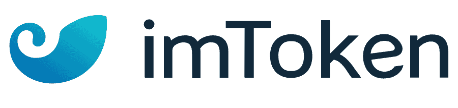
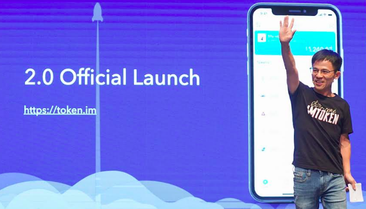
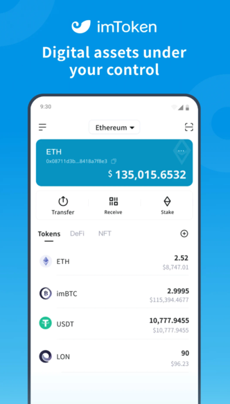
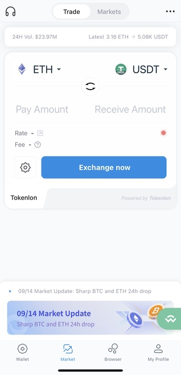
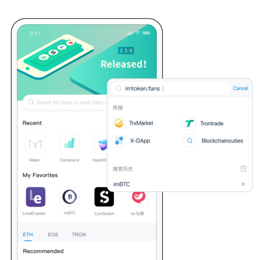
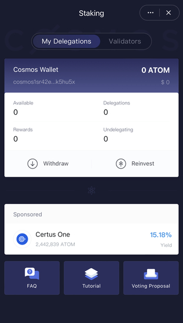
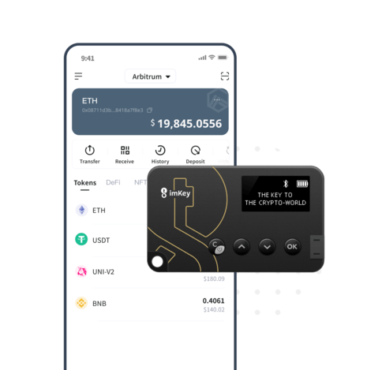
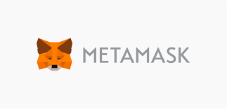
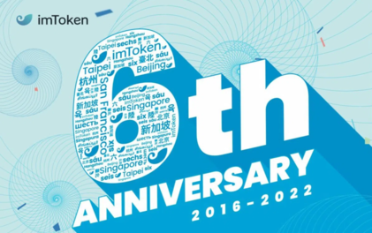

# imToken Case Study

  

## Overview and Origin

### Background

imToken is a feature-rich digital asset wallet enabling multi-chain asset management, DApp browsing and secure, private exchange of value. It supports BTC, ETH, EOS, TRX, CKB, BCH, LTC, DOT, KSM, FIL and many other crypto assets. 

Established on May 2016, imToken strives to bridge the gap between blockchain technology and general masses with a simple, secure yet powerful digital asset management tool. 

The company was launched in Hangzhou, China, before moving to it current headquarters to Singapore, and about 70% of its users are in mainland China, followed by markets including South Korea, the United States and Southeast Asia.

In the span of 2 years, imToken has expanded the outreach to millions of users from more than 200 countries, becoming the world’s largest Ethereum wallet. 

### Founder

The founder of the company is Ben He (Bin He), who has more than ten years of experience in Internet product design and development. Ben is an early member of a blockchain technology research team, which founded a series of successful blockchain startups. He started paying attention to Bitcoin back in 2013 and a year later, the Ethereum platform. He has previously worked with digital currency exchanges, data storage entities, and is currently focusing on smart contract technology and digital asset management.

### Funding
imToken has raised a total of $40M in funding over 2 rounds. Their latest funding was raised on Mar 30, 2021 from a Series B round.

Series A: May 31, 2018

* Lead/Sole investor: IDG Capital, based in Beijing
* Money Raised: 10M 

Series B: Mar 30, 2021 

* Lead investor: Qiming Venture Partners, based in Shanghai
* Other investors: Breyer Capital, HashKey Capital, IDG Capital Partners, LongLing Capital, SNZ Holding and Signum Capital
* Money Raised: $30M

## Business Activities

### Services Provided

Back in 2016, the company started imToken with a small group of people, when Ethereum was still in its early days. They wanted to offer people access to this new and exciting land of possibilities: sending tokens and owning crypto on their own devices.

In the very beginning imToken was only a wallet to send and receive ETH and ERC20 tokens. At that time, blockchain was still widely unknown in Asia. But that changed quickly in the following years. Now, they are offering more features and access to more blockchains to their users.

imToken’s ecosystem of products include Tokenlon, an in-app decentralized exchange (DEX), and a decentralized app (DApp) store.

1. Multi-Chain Wallets Management
   * Manage your BTC, ETH, EOS, ATOM, BCH, TRX, LTC, CKB, DOT, KSM, FIL, XTZ tokens easily
   * Supporting main stablecoins, like USDT, USDC, DAI, PAX, TUSD, USDX
   * Comprehensive risk control system and wallet protection
   * Third-party security audit

   

2. In-app decentralized exchange (DEX): Tokenlon

    * DEX stands for decentralized exchange, it is a peer-to-peer marketplace where transactions occur directly between crypto traders. DEXs fulfill one of crypto’s core possibilities: fostering financial transactions that aren’t officiated by banks, brokers, or any other intermediary. 
    * The Tokenlon team was initially part of imToken wallet team, it is a decentralized crypto exchange platform like coinbase, binance, etc.

    

3. In-app browser-based DApp store
   * imToken has listed 150+ premium DApps
   * Supporting ETH, EOS, TRON DApps

4. Staking
   * Staking is like a less resource-intensive alternative to mining. It involves holding funds in a cryptocurrency wallet to support the security and operations of a blockchain network. Simply put, staking is the act of locking cryptocurrencies to receive rewards. It's like depositing money in your bank account and receiving interest, though the technical mechanism is quite different.

   

5. Hardware Wallet: imKey
   * imKey is a mobile hardware wallet — mobile in the sense that it’s light and small (fitting into your leather wallet) and equipped with a secure bluetooth channel.
   * Military-grade CC EAL 6＋ security chip
   * Support imToken
   * Cross-platform Use and Management

### Technologies
In order to design a secure, fast and user-friendly crypto wallet, the development team needs to be equipped with deep knowledge of modern web service development, including networking, cloud services (AWS or GCP), clustering technology (Kubernetes), containerization, databases, programming languages, and cryptography solutions etc.

### Challeges
1. Regulation
   * Regulation is always lagging. Every step early movers take forward will face risks and challenges because many areas are unknown for both regulators and early movers.
   * Regulations won’t become fewer, but rather more plenty. There will be some major steps taken by the US regulators to bring legal frameworks around blockchains and tokens.

2. Security
   * The banking system has had years to develop anti-fraud mechanisms that help detect a compromised credit card. If irregular spending patterns or locations are showing up on your statement, you would be flagged, whereas there are no such controls with your private key.

3. Technology evolution
   *  The development team must keep up with the fast growth and disruption of blockchain technologies, emerging crypto currencies and DApps.

4. Market Education
   * Blockchain products need to lower the barriers to attracting mass-market users, the layperson doesn’t have a strong understanding of how this software works, and may expect similar controls to the conventions they were used to before when utilizing a credit card. That’s why these problems must be solved in order for cryptocurrency solutions to scale to the masses.

### Major Competitors

Competition in the crypto wallet domain is fierce. Since crypto wallet is not only a digital asset management tool but also a key entry point/connector to all the related services/applications, players from all aspects of Web 3.0 want to have their own product in the digital wallet domain. 

>MetaMask Wallet: Best browser-based crypto wallet app

* Metamask is one of the most popular NFT wallets. It is downloadable as a mobile web wallet or a browser extension. You can access the best NFT collectibles and various decentralized applications.

* It is suitable for novice users because it allows them to learn as they get valuable guides from Metamask. You can easily access market trends on Enjin and trade the digital assets you need. This wallet app has push notifications that you can allow to stay ahead of the news. It is one of the best NFT wallets for inexperienced NFT collectors to learn at their pace.

>Trust Wallet: Best multi-functional wallet

* Trust Wallet enables you to send and receive ETC and other cryptocurrencies, as well as participate in ICOs and airdrops.

* Trust wallet supports game assets ERC1155 and ERC721 crypto NFTs on the Ethereum blockchain. It is an easy-to-use platform suitable for novice NFT traders. Trust wallet has 53 blockchains with access to smart chain tokens. The exchange provides a detailed view of the NFT gallery.

* Trust wallet has a dApp browser that helps you find the best NFT collectibles with a straightforward trading framework. If you are a new wallet user in BEP tokens, the Trust wallet is your best choice. It is one of the best NFT wallets in browser integration to help you exchange your cryptocurrency assets for supported tokens.

* Acquired by Binance on July 2018. If you have a trading account with Binance, then using Trust Wallet becomes really easier because Trust Wallet is now owned by Binance. So, it supported a lot of coins that Binance offers.

>Ledger Nano X Wallet (Best Hardware Wallet)

  

* Ledger Nano X is a cold wallet where you can store NFTs and cryptocurrency. It is the best NFT wallet for security. Ledger Nano X is an offline wallet that runs on a trading and storage software device. SO, activating the wallet requires an internet connection, but only when confirming your trades.

* The Ledger Nano X cold wallet uses a seed phrase of 14 to 24 words for authentication. It makes it the safest wallet account type because the connection is not a direct one but to register changes on the blockchain. You can trade the best NFT collectibles and cryptocurrencies through markets on Ledger.

## Roadmaps
1. imToken 1.0
* The imToken 1.0 wallet **only supported Ethereum tokens based on the ERC20 Token Standard** and, according to imTokens website, became the worlds largest Ethereum wallet.

2. imToken 2.0
* imToken 2.0 is a **multi-chain cryptocurrency wallet** that allows users to use one identity to manage multiple wallets with one mnemonic. phrase. The imToken 2.0 wallet retained the functions of imToken 1.0 and added the ability to manage both Ethereum (ETH), Bitcoin (BTC), and EOS (and EOS tokens).  Upon the release of imToken 2.2.1 the wallet introduced biometric verification that allows users to send tokens after verifying their identities with face ID & their fingerprint.

3. imToken 3.0
* ImToken will use its latest funding to build features for “imToken 3.0.” This will include **keyless accounts, account recovery and a suite of decentralized finance services**. 
* It also plans to expand its research arm for blockchain technology, called imToken Labs and open offices in more countries. It currently has a team of 78 people, based in mainland China, the United States and Singapore, and expects to increase its headcount.

## Vision

imToken recently hosted an event in Singapore titled “**_Equal Access to the Tokenized World._**” It will focus on the realization of a Web 3.0 “Tokenized World”. 

>
>_“The wallet is known as ‘the home of Token’ and has played a critical role in assisting users in gaining access to the tokenized world. imToken aims to make the wallet an entryway to attract mass-market consumers._

## Recommendations

Since the technology evolution in Web 3.0 is growing fast, it is with no doubt that digital asset management facilities like crypto wallets will play a more and more important role in our future life.

As one of the first movers and dominators in crypto wallet domain, imToken, once said to be the biggest Ethereum crypto wallet in the world, hasn't secured its place among numbers of strong competitors. It originated from China where it gained a large number of seed users in the beginning, but at the moment, the government has banned crypto-related currencies, applications and platforms in China.

Key recommendations to imToken will include:
* Enhance network and storage security, fraud detection and  protections. Asset safety will always be the No.1 priority, especially in the tokenized world, one fraudulent transaction will cost the wallet owner lose all. Those who can protect clients' assets in a safe way will be much more likely to gain the market share. 
* Support for browser and make the APIs easier for other platforms/DApps to integrate with
* More branding and marketing campaigns, e.g. the current marketing campaigns conducted by imToken 'Learn to Earn' gives the users free NFT tokens if the users can pass the quiz and get 100/100 points. Marketing activities and campaigns like this will not only educate the users understand more about the features and functions, but also will increase the trust and loyalty of the customers.

### Summary

A more recent survey revealed that there are now 68.42 million blockchain wallet users. Crypto Market Sizing The cryptocurrency market size is expected to grow from USD 1.6 billion in 2021 to USD 2.2 billion by 2026, at a CAGR of 7.1%. 

Since 2016, imToken has served **14M+** users, with over **$500B** cryptocurrencies exchanged in over 150 countries & regions around the world. 

In the next ten to twenty years, blockchain will revolutionize the financial industry on a global scale. We believe that imToken is riding this trend, and has strongly positioned itself in the market.

## Resources
* https://www.crunchbase.com/organization/imtoken
* https://luminarychiefs.com/interviews/ben-he-bin-founder-and-ceo-of-imtoken/
* https://www.finder.com.au/cryptocurrency/wallets#compare
* https://money.com/best-crypto-wallets/ 
* https://coinjournal.net/news/ethereum-wallet-imtoken-raises-us10m-series-a-from-idg-capital/
* https://mobile.twitter.com/OpenLeverage/status/1560174663044661249 
* https://cryptoslate.com/press-releases/a-brand-new-arbitrum-experience-comes-on-imtoken-v-2-10/ 
* https://beincrypto.com/imtoken-will-focus-on-the-realization-of-a-web-3-0-tokenized-world/
* https://golden.com/wiki/imToken-8ARBRBJ 
* https://cryptoslate.com/tokenlons-head-of-growth-on-the-challenges-of-building-a-decentralized-exchange-crypto-predictions-for-2021-and-more/
* https://www.guru99.com/best-nft-wallets.html 
* https://www.ulam.io/blog/custom-cryptocurrency-wallet-development-challenges#:~:text=The%20main%20problems%20crypto%20wallets,the%20wallet%20is%20fully%20compromised.
* https://crypto.com/research/2021-crypto-market-sizing-report-2022-forecast
* https://www.coinbase.com/learn/crypto-basics/what-is-staking
* https://viraltalky.com/trust-wallet-vs-metamask-comparison/ 

  